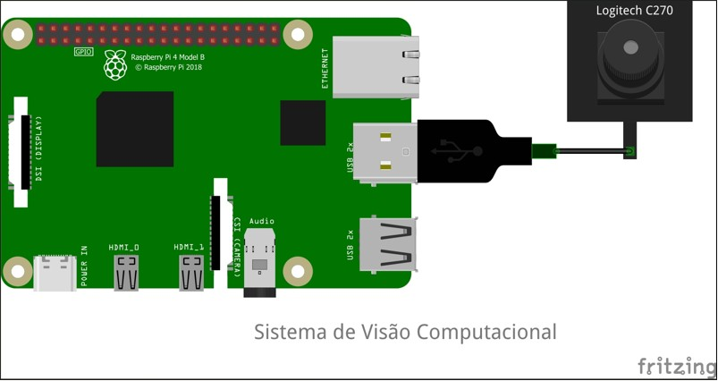
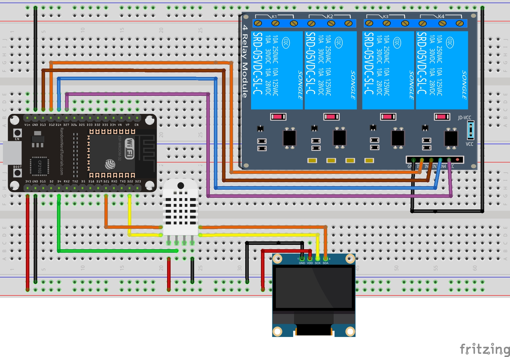

# 🧠 Controle de Dispositivos por Gestos Faciais com Raspberry Pi + ESP32

Este projeto propõe uma solução inclusiva e acessível baseada em **visão computacional**, permitindo o **acionamento de relés com gestos faciais** (como sorriso, piscar e levantar sobrancelhas), usando um **Raspberry Pi 4 com uma web cam Logitech C270HD** e um **ESP32 conectado via MQTT (Ubidots)**.

## 📌 Objetivo

Facilitar o controle de dispositivos elétricos por meio de gestos faciais, promovendo **acessibilidade** para pessoas com mobilidade reduzida.

---

## 🔧 Tecnologias Utilizadas

- **Raspberry Pi 4** com sistema Debian
- **Python 3.11**
- **OpenCV** e **MediaPipe** para detecção de gestos
- **MQTT (Ubidots)** para comunicação com ESP32
- **ESP32** para controle físico dos relés
- **DHT22** para leitura de temperatura e umidade

---

### 🔷 Esquema Raspberry Pi + Câmera



> Conexão entre Raspberry Pi 4, câmera USB e sistema de controle facial para envio de comandos via MQTT.

### 🔷 Esquema ESP32 + Sensor + Relés



> Diagrama de ligação do ESP32 com sensor DHT22 e relés, usando MQTT para receber comandos e enviar medições.

## 🧠 Funcionalidades

- 🧏‍♂️ **Leitura de gestos faciais** em tempo real:
  - Levantar sobrancelha → Ativar "modo comando"
  - Sorriso por tempo variável → Aciona relés
  - Fechar olho direito por tempo variável → Desativa relés

- 🌡️ **Monitoramento ambiente**:
  - Temperatura e umidade exibidas no painel lateral

- ⚡ **Feedback visual do estado dos relés** (sala, cozinha, quarto, banheiro)

---

## 📂 Estrutura do Projeto

```
controle-gestos-raspberry/
│
├── raspberry/
│   └── facedetector_mqtt.py       # Script principal com visão computacional
│
├── esp32/
│   └── main_esp32.ino             # Código do ESP32 com MQTT + leitura DHT22
│
├── requirements.txt               # Dependências Python
└── README.md                      # Este arquivo
```

---

## 🚀 Como Executar

### 1. Clonar o repositório
```bash
git clone https://github.com/tomtecsolutions/facedetector_mqtt.git
cd controle-gestos-raspberry
```

### 2. Criar ambiente virtual (opcional mas recomendado)
```bash
python3 -m venv venv
source venv/bin/activate
```

### 3. Instalar dependências
```bash
pip install -r requirements.txt
```

### 4. Executar o script no Raspberry Pi
```bash
cd raspberry
python3 facedetector_mqtt.py
```

---

## ⚙️ Configurações MQTT

A comunicação entre Raspberry Pi e ESP32 é feita via **Ubidots MQTT**:

- Broker: `industrial.api.ubidots.com`
- Porta: `1883`
- Tópicos de envio:
  - `/v1.6/devices/esp32_automation/sala`
  - `/v1.6/devices/esp32_automation/quarto`
  - `/v1.6/devices/esp32_automation/cozinha`
  - `/v1.6/devices/esp32_automation/banheiro`
- Tópicos de feedback:
  - `.../sala_status`, `quarto_status`, `cozinha_status`, `banheiro_status`
- Sensores:
  - `.../temperatura`, `.../umidade`

---

## 🧪 Exemplo de Interface

> Exibição lateral com:
> - Status dos relés
> - Temperatura e umidade
> - Instruções de uso e limiares
> - Feedback em tempo real sobre os gestos reconhecidos

---

## 🤝 Créditos

Desenvolvido por [Wellington Dorta](https://www.linkedin.com/in/wellingtondorta) como projeto de automação com foco em acessibilidade e visão computacional.

---

## 📘 Licença

Este projeto está licenciado sob a [MIT License](LICENSE).
